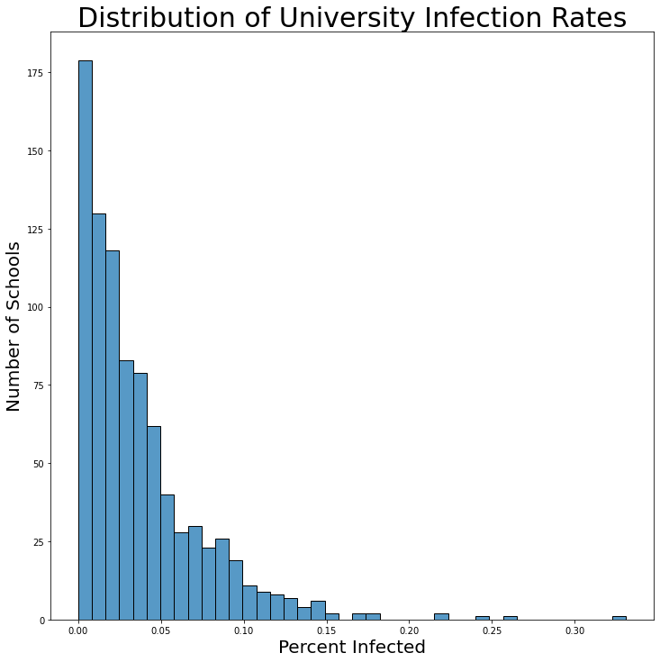

# Predicting Coronavirus Infections

Aziz Maredia, Katharine King, Max Bosse, Manuel Sainz de la Peña

---

## Problem Statement

What attributes of colleges contribute to an increased probability that the campus will see greater than 5% of the student population infected with the Coronavirus?

---
## Background
The New York Times has been tracking and publishing Coronavirus Infections at universities in the United States throughout the pandemic of 2020. As students begin to decide whether or not to begin and attend college in-person or remotely, and as colleges set policies for physical classes and sporting events, understanding how the college's attributes affected the Coronavirus case counts in the Fall 2020 may help students and colleges make informed decisions about the Spring semester of 2021. Our project seeks to understand how various admissions statistics, state precautions, and college attributes relate to the infection rates. Starting with the list of universities reported by the New York Times, information was pulled from the Integrated Postsecondary Education Data System, including Admission Test scores, Football conference memberships, applicant pool sizes, and pre-2020 distance learning offerings. Additional data was pulled and merged from the Kaiser Family Foundation that lists the college's intended plan for the Fall of 2020.

## Table of Contents
1. [1_intro_data_merging_cleaning](./1_intro_data_merging_cleaning.ipynb)
2. [2_exploratory data_analysis](./2_exploratory_data_analysis.ipynb)
3. [3_feature_engineering_modeling_conclusions](./3_feature_engineering_modeling_conclusions.ipynb)
4. [Presentation](./Assets/project_5_college_covid_analysis.pdf)
5. [Executive Summary](./Assets/Executive_Summary)

## Datasets and sources
---
* [`nyt_college.csv`](./datasets/nyt_college.csv): Colleges and counts of Coronavirus case counts, [NYT Repository](https://github.com/nytimes/covid-19-data/tree/master/colleges)
* [`admissions1.csv`](./datasets/admissions1.csv): Data pulled from IPED's database, part 1, [IPED Database](https://nces.ed.gov/ipeds/)
* [`admissions2.csv`](./datasets/admissions2.csv): Data pulled from IPED's database, part 2, [IPED Database](https://nces.ed.gov/ipeds/)
* [`sports.csv`](./datasets/sports.csv): Data pulled from IPED's database, part 3, [IPED Database](https://nces.ed.gov/ipeds/)
* [`regions.csv`](./datasets/regions.csv): State region and sports division
* [`state_policies.csv`](./datasets/state_policies.csv): State Social Distancing and other Coronavirus policies as of August 11th, [Kaiser Family Foundation](https://github.com/KFFData/COVID-19-Data/tree/kff_master/State%20Policy%20Actions/State%20Social%20Distancing%20Actions)
* [`classplan.csv`]('./datasets/classplan.csv'): Dataset of colleges and their intended plan for the Fall of 2020 [The Chronicle of Higher Education](https://www.chronicle.com/article/heres-a-list-of-colleges-plans-for-reopening-in-the-fall/)
* [`combined_df.csv`]('./datasets/combined_df.csv): Merged Dataframe created in [intro_data_merging_cleaning]('./code/intro_data_merging_cleaning.ipnyb')

## Data Cleaning and Ingestion
The Datasets above were cleaned to exclude null values for test scores and case counts. Schools without test score data were largely community colleges where the student population often lives within the community full-time. After merging all of the datasets, the final dataset included 900 Universities from across the United States. From the New York Times case counts, a new column was engineered based on the total enrolled population of students and professors to indicate whether or not the total case count was greater than 5% of the enrolled total. This column was used as the target column for our models to predict. The histogram below shows the distribution of the engineered column 'percent_infected.' We decided to explore the 5% cut off in part due to the distribution of data shown below.

---
## Key Features in combined_df.csv

|Feature|Type|Origin Dataset|Description|
|---|---|---|---|
**state**|*obj*|nyt_college.csv|State of college's location
**college**|*obj*|nyt_college.csv|College Name
**cases**|*float*|nyt_college.csv|The total number of reported Covid-19 cases among university students and employees in all fields, including those whose roles as doctors, nurses, pharmacists or medical students put them at higher risk of contracting the virus, since the beginning of the pandemic. As on Dec 11th.
**college_size_category**|*float*|IPED Data|Institution size category based on total students enrolled for credit,
**distance_educ_offered**|*float*|IPED Data|A course in which the instructional content is delivered exclusively via distance education. Requirements for coming to campus for orientation, testing, or academic support services do not exclude a course from being classified as distance education.
**admissions_total**|*float*|IPED Data|Number of first-time, degree-seeking undergraduate students who applied, were admitted, and enrolled.
**freshmen_enrollment**|*float*|IPED Data|
**admissions_men**|*float*|IPED Data|Number of first-time, degree-seeking undergraduate students who applied, were admitted, and enrolled and identify Male
**admissions_women**|*float*|IPED Data|Number of first-time, degree-seeking undergraduate students who applied, were admitted, and enrolled and identify Female.
**number_freshmen_submitting_sat**|*float*|IPED Data|If test scores are required for admission for first-time, degree/certificate-seeking undergraduate students, the number of students submitting SAT scores.
**number_freshmen_submitting_act**|*float*|IPED Data|If test scores are required for admission for first-time, degree/certificate-seeking undergraduate students, the number of students submitting ACT scores.
**sat_ebrw_25**|*float*|IPED Data|25th percentile scores for the Evidence-Based Reading and Writing portion of the SAT submitted.
**sat_ebrw_75**|*float*|IPED Data|75th percentile scores for the Evidence-Based Reading and Writing portion of the SAT submitted.
**sat_math_25**|*float*|IPED Data|25th percentile scores for the Mathematics portion of the SAT submitted.
**sat_math_75**|*float*|IPED Data|75th percentile scores for the Mathematics portion of the SAT submitted.
**act_comp_25**|*float*|IPED Data|25th percentile Composite ACT scores submitted.
**act_comp_75**|*float*|IPED Data|75th percentile Composite ACT scores submitted.
**act_english_25**|*float*|IPED Data|25th percentile scores for the English portion of the ACT
**act_english_75**|*float*|IPED Data|75th percentile scores for the English portion of the ACT
**act_math_25**|*float*|IPED Data|25th percentile scores for the Math portion of the ACT
**act_math_75**|*float*|IPED Data|75th percentile scores for the Math portion of the ACT
**football_conference**|*obj*|IPED Data|Conference number if the college is a NCAA or NAIA member for football.
**region**|*obj*|regions.csv|Region the state falls into for football.
**status_reopening**|*obj*|state_policies.csv|State Reopening Status as of August 11th, [ Proceeding; Paused; New Restrictions Imposed; Reopened]
**stay_at_home_order**|*obj*|state_policies.csv|State Stay at Home order as of August 11th [Original Stay at Home Order in Place; Stay at Home Order Eased or Lifted; No Action
**large_gatherings**|*obj*|state_policies.csv|State Large Gathering Ban Status as of August 11th [Original Gathering Ban/Limit in Place; Gathering Ban/Limit Expanded or Lifted; New Gathering Ban/Limit in Place; No Action]
**bar_closures**|*obj*|state_policies.csv|State Bar Closures as of August 11th [Closed; Reopened; Newly Closed; New Service Limits]
**restaurant_limits**|*obj*|state_policies.csv|State Restaurant Limitations as of August 11th [ Restaurants Reopened to Dine-in Service; Newly Closed to Dine-in Service; New Service Limits; No Action]
**face_coverings**|*obj*|state_policies.csv|State Face Covering Requirements as of August 11th [Required for General Public; Required for Certain Employees; Allows Local Officials to Require for General Public; No Action]
**class_plan**|*obj*|Classplan.csv|College plans to host classes [ 'Primarily in person', 'Primarily online', 'Hybrid', 'Fully online', 'Fully in person', 'Undetermined', 'Other',]
**percent_infected**|*float*|Engineered|Engineered from Total Enrollment
**greater_than_5**|*int*|Engineered|Indicates whether a college has case counts that exceed 5% of the total enrolled population|

## Software Packages Required
Numpy, Pandas, Matplotlib Scikit-learn, Seaborn, Tensorflow
